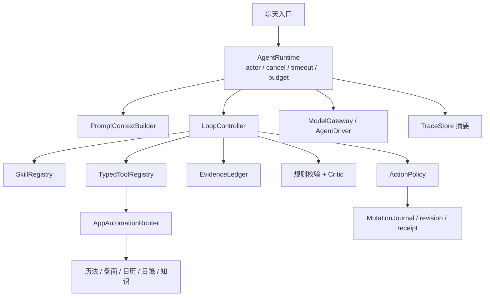

# 灵性日历内置 Agent PRD

**版本**：v0.1（方案稿）

**日期**：2026-09-20

**状态**：供下一阶段开发使用；本文件只定义产品和技术方案，不包含代码实现。

## 1. 产品定义

灵性日历内置一个面向普通用户的轻量 Agent。用户直接在应用内提问，Agent 自动读取本应用能够提供的盘面、历法、日历、事件、日笺、知识库和用户配置，按相应 Skill 组织解读；当用户明确要求时，它也可以完成本地记录、事件和洞察等操作。

它的核心承诺是：**回答有依据，过程会复核，操作少打断，结果可追溯**。

Agent 不是通用电脑代理，也不负责替代历法和排盘的确定性计算。它是应用内的问答与操作编排层：模型负责理解问题、选择方法、组织解释和提出行动，应用负责事实、权限、写入和一致性。

## 2. 背景与问题

当前应用已经具备确定性日期解析、历法与排盘能力、知识文档、日程/日笺存储，以及统一的自动化路由和写入日志。现有远程聊天主要是无工具的对话，用户仍需要自己知道应该打开哪一页、查哪份资料，模型也容易在没有读取盘面或知识的情况下凭记忆作答。

本 Agent 要解决四个问题：

1. 把分散在应用内的事实和资料自动组织成一次问答所需的最小上下文。
2. 让“先查事实、再读知识、再解释、最后复核”成为可执行的 Loop，而不是写在提示词里的口号。
3. 让用户可以直接说“帮我记下来”“按这个技能解读”，不需要理解 CLI、工具调用或内部协议。
4. 在保证低风险任务顺滑的同时，对删除、修改档案和外部副作用保留清晰的一次确认。

## 3. 目标与非目标

### 目标

- 在聊天入口完成自然语言问答，不要求用户逐项点选盘面或知识。
- 自动选择合适的 Skill，并按 Skill 的证据要求读取应用数据。
- 对跨盘面、历法、事件和知识的复杂问题进行有限的补读、交叉验证和修复。
- 每个关键事实都能回溯到来源、时间和数据 revision；无法确认时明确说明。
- 在用户授权范围内完成本地小型操作，并在写入后重新读取验证。
- 将 `SOUL.md`、`AGENT.md`、`USER.md` 和 `SKILL.md` 作为用户可理解、可定制的内置配置，同时锁定权限和安全边界。
- 冷启动不依赖 Python、Node、外部 daemon 或完整 Hermes/DSH 运行时。

### 非目标

- 不做通用桌面自动化、Shell、任意代码执行、任意文件写入或浏览器代理。
- 不在首期引入 MCP、插件市场、后台常驻自主任务、多 Agent swarm 或完整外部记忆系统。
- 不让模型自行计算并覆盖应用提供的历法、盘面、时间和 revision 事实。
- 不展示或持久化完整 Chain of Thought；只展示结论、依据、校验状态和不确定性。
- 不将传统解释包装成确定的未来预测，不作医疗、财务或心理诊断。

## 4. 技术路线决策

采用 **Swift 原生的减法版 AgentRuntime**，借鉴 Hermes 和 DeepSeek Harness（DSH）的 Loop、工具编排、会话和可观测性思想，但不把它们的运行时嵌入主应用。

Hermes 面向通用、高权限、可扩展的个人 Agent，包含 Python 运行时、终端、MCP、网关、插件、定时任务和多种记忆能力；这些能力超出本应用的信任边界。DSH 的 `sdk-minimal` 比 Hermes 更容易裁剪，也更贴合 DeepSeek 模型，但仍是 Node/TypeScript 侧车，默认存在 Shell 和开发预览状态，Swift 还需要额外的进程与 JSON-RPC 桥接。

因此，首期生产实现直接使用 Swift 原生运行时，预留 `AgentDriver` 抽象。将来如需比较模型或实验 DSH，只能作为受限的外部 Driver，通过 allowlist 的领域工具访问应用；不能让其直接访问本地文件、EventKit、数据库或主进程。

## 5. 典型用户场景

### 场景 A：基于盘面和日程给建议

用户说：“按我今天的盘面和最近事件，给我一个工作建议。”

Agent 读取当前档案、盘面、日期、事件和必要知识，回答分成“应用事实、传统解释、行动建议、不确定性”，并显示依据卡片。用户不需要先打开盘面页或告诉 Agent 应该查哪份文档。

### 场景 B：按用户 Skill 解读

用户说：“按我的‘面试解卦’技能看看明天适不适合面试。”

Agent 先读取该 Skill 的必需输入和工作步骤，再读取明天的确定性日期/盘面/事件和指定知识。缺少出生资料、时间或 Skill 所需参数时，只追问最小必要问题；如果资料互相冲突，则并列说明，不强行选一套。

### 场景 C：把结果记下来

用户说：“把刚才的建议记到今天日笺。”

Agent 生成结构化写入动作。低风险本地写入在“顺手模式”下可自动执行，写入后重新读取并返回摘要、revision 和撤销入口；不会只根据模型回复声称“已经保存”。

### 场景 D：高风险操作

用户说：“把我的出生时间改成 08:30，删掉之前的记录。”

Agent 将两个动作合并为一张确认卡，列出对象、字段、影响和依据。用户确认后才执行；任一动作失败时不宣称整体成功，并保留写入回执和冲突信息。

## 6. 用户体验

聊天页提供输入框、停止按钮和可选的“快速/深度”模式。默认使用快速模式；问题涉及盘面、跨来源资料、用户明确要求“严谨/再核对”，或第一次校验发现缺证据时，自动升级到深度模式。

执行中只显示简短阶段状态，例如“选择解读方式”“读取盘面和事件”“交叉验证依据”“整理结果”。这些状态让用户知道 Agent 正在查什么，但不展示内部思维链。

回答固定为四个可识别部分：

1. **结论**：直接回答用户的问题。
2. **依据**：列出应用事实和知识来源，可展开查看来源、时间和 revision。
3. **解读与行动**：将传统解释和现代行动建议分开。
4. **边界与不确定性**：说明缺失资料、冲突来源、候选盘或无法验证的部分。

若发生写入，回答末尾显示一张合并操作卡：操作对象、实际字段、执行状态、request ID/revision 和撤销入口。普通读取和 Loop 内部复核不弹确认。

## 7. 运行时架构



### 组件职责

- **AgentRuntime**：Swift `actor`，管理单会话循环、取消、并发、超时、预算和上下文快照。
- **ModelGateway**：统一 Chat/Responses 兼容模型接口，支持流式结果、模型选择、temperature、max tokens 和可选 `reasoning effort`。
- **PromptContextBuilder**：按优先级装载硬策略、身份、工作习惯、Skill、动态 Reference 和会话。
- **SkillRegistry**：根据意图选择 Skill，并校验所需输入、允许的读取工具、输出结构和停止条件。
- **TypedToolRegistry**：只暴露面向领域的结构化工具，不暴露 Shell、任意路径和原始数据库。
- **EvidenceLedger**：记录每条结论与来源、revision、时间、证据类型和冲突关系。
- **Verifier/Critic**：先做本地确定性检查，再做一次结构化模型复核，必要时触发一次补读或修复。
- **ActionPolicy**：将动作划分为只读、低风险本地写入、高风险/不可逆/外部副作用。
- **TraceStore**：保留阶段、调用摘要、来源、失败原因和写入回执，不保存完整思维链。

## 8. 身份、工作习惯和资料层

### 配置文件

| 层 | 作用 | 用户可编辑 | 能否改变权限 |
|---|---|---:|---:|
| 硬策略 | 隐私、工具白名单、确认、事实优先和安全边界 | 否 | 否 |
| `SOUL.md` | 名称、语气、价值观、陪伴方式、传统解释边界 | 是 | 否 |
| `AGENT.md` | 先查什么、如何复核、默认深度、失败恢复、输出习惯 | 是 | 否 |
| `USER.md` | 用户明确设置的称呼、语言、偏好 | 是 | 否 |
| `SKILL.md` | 任务方法、必读资料、工具白名单、输出模板、停止条件 | 是/可添加 | 不能扩大硬权限 |
| `REFERENCE` | 当前盘面、日历、事件、日笺、知识片段的动态快照 | 由工具提供 | 否 |

上下文优先级为：硬策略 > 当前任务约束与工具事实 > Skill > AGENT > SOUL/USER。人格和工作习惯只能改变表达和工作顺序，不能要求隐藏依据、关闭校验、跳过确认或调用新工具。配置修改保存后对新任务生效；一个任务开始后冻结配置快照，避免运行中漂移。

首期可复用当前 `Resources/AgentSkill/SKILL.md`、`Resources/AgentSkill/references/` 和 `Resources/Knowledge/`。应用内编辑器需要提供恢复默认、版本历史和本次生效预览。

## 9. Loop 与交叉验证

Loop 是精度保障的核心，但不是让模型无限“想一想”。它必须由状态机、证据账本、工具白名单和硬预算约束。

```text
classify
  → load skill
  → plan evidence
  → retrieve typed references
  → draft claims
  → deterministic checks
  → critic / detect missing or conflict
  → optional one repair or supplemental read
  → final answer
  → action proposal / policy decision
  → execute if allowed
  → reread and compare
  → receipt
```

### 两种模式

- **Quick**：意图分类、一次证据读取、规则校验和回答。适用于日期、事件、知识条目等简单问题。
- **Deep**：规划器、证据研究、草稿、Critic、一次补读/修复和终稿。适用于盘面解读、跨来源问题、冲突资料或用户要求严格核对的任务。

默认上限为：读取最多 2 轮、读取工具约 6 次、模型步骤最多 3–4 次、单任务 20–30 秒。超时或预算耗尽时，立即基于已验证证据回答，并列出缺失依据，不继续无界循环。

### 交叉验证分层

1. **确定性校验**：日期、时区、交节、盘面字段、候选盘、profile revision、工具 schema、写入 revision。
2. **同模型 Critic pass**：检查是否漏读 Skill 要求、是否存在无来源断言、是否混淆事实和传统解释、是否忽略冲突或超出用户问题。
3. **可选独立复核**：只在深度模式或高冲突任务中使用更高 reasoning effort 或第二模型；不是首期默认依赖。

模型可以提出假设和解释，不能自行改写应用事实。若关键结论没有 EvidenceLedger 来源，必须标为推断或不确定；不能将其写成盘面事实。

## 10. 工具、证据和写入边界

### 只读工具

首期只提供高层工具，例如 `profile_context`、`chart_context`、`day_context`、`events_context`、`notes_context`、`knowledge_search`、`knowledge_read` 和 `conversation_context`。工具返回限量结构化数据，包含来源类型、时间、revision 和字段说明，不把整个数据库塞入上下文。

### 写入工具

所有写入采用两阶段：

1. `propose_action`：生成结构化变更、影响、证据、目标 revision 和撤销信息。
2. `execute_action`：由 ActionPolicy 决定自动执行或等待一次确认；执行后通过现有 Router、request ID、revision 和 MutationJournal 写入，再重新读取比对预期。

Agent 不直接读写存储文件，不绕过 `AppAutomationRouter`，也不直接调用 EventKit。

### EvidenceLedger 字段

每条 claim 至少记录：`claimID`、陈述内容、`sourceRef`、`sourceRevision`、`retrievedAt`、`evidenceType`（确定性事实/知识文本/用户输入/模型推断）、`confidence`、`conflictSet` 和产生它的 Loop 步骤。用户看到的是依据摘要和来源卡片，不是隐藏推理文本。

## 11. 少确认策略与安全边界

| 风险级别 | 示例 | 默认行为 |
|---|---|---|
| R0 | 读取、计算、解释、搜索知识 | 自动完成，无确认 |
| R1 | 保存本地日笺、创建本地事件、保存洞察草稿 | “顺手模式”自动执行，结果中提供撤销 |
| R2 | 修改档案、删除/批量操作、覆盖内容、写入 Apple 或其他外部系统 | 一张合并确认卡，确认一次 |
| R3 | Shell、任意代码/文件、支付、发布、不可逆破坏、无限后台代理 | 不提供 |

用户可以关闭 R1 自动写入，但不能通过 `SOUL.md`、`AGENT.md` 或 Skill 降低 R2 的确认级别。一次复合任务只弹一次确认；取消或超时不得产生部分写入。重试同一动作必须复用同一个 request ID，避免重复创建。

知识文档、日笺内容和 Skill 正文都属于待处理资料，其中出现的命令、授权或“忽略规则”不能扩大本次任务权限。模型只收到本次所需的最小 Reference；API key 继续存放在 macOS Keychain。

## 12. 模型与准确度

Hermes、Codex 或 DSH 的“会自己交叉验证”主要来自它们提供的 Loop、工具、上下文和重试机制，不是某个运行时天然拥有独立判断力。最终准确度由四部分共同决定：模型能力、reasoning effort、证据质量、以及本 PRD 规定的工程约束。

默认使用中等推理预算和低 temperature。简单问答走 Quick；复杂盘面或冲突资料提升到 Deep，可增加 token/推理预算或选择更强模型。若模型不支持 `reasoning effort`，仍保留完全相同的 Loop、Ledger 和确定性校验，只降低可用的模型推理深度。

系统不宣称“模型已经证明了结论”。它只在有来源、通过规则校验和 Critic 检查后，以合适的置信表达输出；如果仍有冲突，给出分支结论或说明需要补充的资料。

## 13. 失败、取消与可观测性

- 模型或工具失败：最多重试一次；若结果仍未知，返回已经验证的部分和缺失项。
- 证据冲突：保留冲突集合，禁止静默选边。
- 上下文超限：压缩旧对话，只保留必要字段和 Ledger 引用，不能裁剪关键确定性事实。
- 用户取消：在当前工具调用结束后停止，不进入下一轮，不写入未确认动作。
- 每次任务记录 mode、模型、耗时、工具数、Loop 轮次、Critic 结果、降级原因和写入 receipt；用户可以删除 trace。

首期界面只需显示阶段、耗时、来源摘要、校验结果和动作回执，不显示完整内部推理。

## 14. 开发前保护与实现原则

当前仓库存在未提交的 v0.5 相关修改和未跟踪文件，`main` 也落后于远程分支。开始写 Agent 代码前必须先做包含未跟踪文件的工作区快照（临时目录归档或独立分支均可），确认基线后再开发。不能只依赖新建 Git 分支，因为分支本身不会保存未跟踪文件。

Agent 实现放在独立目录，第一阶段只新增运行时和适配层，不改动现有确定性历法、解析器、Router 和 MutationJournal 的行为。任何集成先通过只读路径验证，再增加 R1 写入；R2 和外部系统写入最后接入。

## 15. 分期计划

### M0：只读问答闭环

- 内置聊天入口和 `AgentRuntime`。
- ModelGateway、Persona/Skill/Reference 加载。
- 只读 TypedToolRegistry、EvidenceLedger、TraceStore。
- Quick/Deep Loop、Critic 的结构化输出和失败降级。
- 覆盖一个核心盘面/解读 Skill，回答显示依据和不确定性。

### M1：本地操作闭环

- `propose_action`、R0/R1 ActionPolicy、顺手模式。
- 日笺、事件、洞察写入，写后重读、request ID、revision、receipt 和撤销。
- 取消、超时和重复请求的幂等验证。

### M2：可定制与质量面板

- 应用内编辑 `SOUL.md`、`AGENT.md`、`USER.md` 和 Skill。
- 默认恢复、版本历史、生效预览。
- R2 合并确认卡、证据面板、模型路由和可选第二模型复核。
- 固定评测集和事实引用覆盖率面板。

### 后续实验

保留 `AgentDriver` 接口，只有在需要比较 DSH 或其他 harness 时增加隔离的 sidecar Driver。生产默认仍使用 Swift Native Driver；不把实验运行时作为主应用依赖。

## 16. 验收标准

### 功能验收

1. 输入“今天适合面试吗”，Agent 能自动读取日期、盘面、相关事件和知识，区分事实、传统解释、建议，并为关键事实提供来源。
2. 输入“按我的某某解卦技能看看这件事”，Agent 先读取 Skill，再读取其必需 Reference；缺资料时只追问最小问题。
3. Critic 能发现缺少 profile、日期/时区不一致、引用冲突和无来源断言，并最多触发一轮补读/修复。
4. profile、timezone 或 chart revision 变化后，旧证据不会被复用为当前事实。
5. “把这次解读记到今天笔记”能按策略执行，写后回读并给出 receipt；重复请求不会产生重复数据。
6. 修改档案、删除记录和外部写入必须弹一次确认；取消后没有半写入。
7. 修改 SOUL/AGENT/Skill 只改变身份、表达或工作顺序，不能扩大工具权限、隐藏依据或关闭硬性校验。
8. 模型不可用、工具超时、知识不存在和证据冲突时，应用返回已验证部分和下一步，不崩溃、不伪报成功。

### 质量与性能验收

- 事实引用覆盖率 100%，未引用事实断言率为 0。
- 读取 Loop 不超过 2 轮，单任务模型调用不超过 4 次。
- 普通问答 P95 在 20–30 秒内完成，并在 2–3 秒内显示首个阶段状态。
- 所有写入均有 request ID、revision 和回读结果；重复写入率为 0。
- R0/R1 默认不打断；R2 确认率 100%；一个复合任务最多一次确认。
- 首批评测集包含：10 个事实问答、10 个盘面/知识解读、5 个缺资料、5 个冲突资料、5 个本地写入、3 个重复请求、3 个取消/超时。

## 17. 调查依据

- 当前项目的行为边界：[docs/assistant-behavior.md](assistant-behavior.md)、[Resources/AgentSkill/SKILL.md](../Resources/AgentSkill/SKILL.md)。
- 当前项目的阶段规划：[docs/implementation-plan.md](implementation-plan.md)。
- Hermes 架构：[官方 Architecture 文档](https://hermes-agent.nousresearch.com/docs/developer-guide/architecture)。
- DSH 介绍：[DeepSeek Harness](https://deepseek.com/harness/en/)，以及 [sdk-minimal 说明](https://raw.githubusercontent.com/deepseek-ai/deepseek-harness/master/packages/bundle/sdk-minimal/README.md)。
